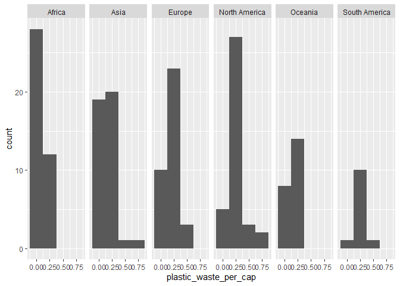
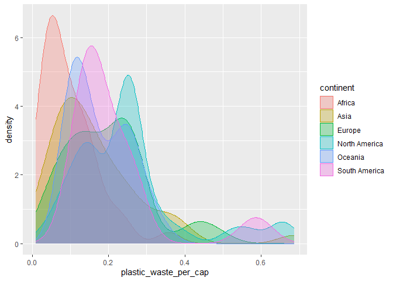
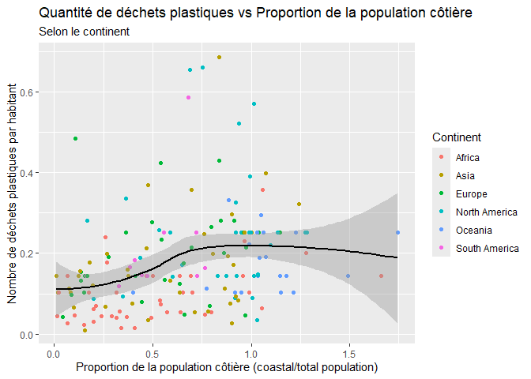

Lab 02 - Plastic waste
================
Laurie Boisclair
21 septembre 2025

## Chargement des packages et des données

``` r
library(tidyverse) 
```

``` r
plastic_waste <- read_csv("data/plastic-waste.csv")
```

Commençons par filtrer les données pour retirer le point représenté par
Trinité et Tobago (TTO) qui est un outlier.

``` r
plastic_waste <- plastic_waste %>%
  filter(plastic_waste_per_cap < 3.5)
```

## Exercices

### Exercise 1

``` r
ggplot(plastic_waste, aes(x = plastic_waste_per_cap)) +
  geom_histogram(binwidth = 0.25) +
  facet_wrap(. ~ continent)
```

<!-- -->

### Exercise 2

``` r
ggplot(plastic_waste, aes(x = plastic_waste_per_cap, color = continent, fill = continent)) +
  geom_density(adjust = 1, alpha = 0.3)
```

<!-- -->

Car alpha ne dépend pas d’une variable, on veut l’appliqué a tout.

### Exercise 3

Boxplot:

``` r
ggplot(plastic_waste, aes(x = continent, y = plastic_waste_per_cap)) +
  geom_boxplot()
```

<!-- -->

Violin plot:

``` r
ggplot(plastic_waste, aes(x = continent, y = plastic_waste_per_cap)) +
  geom_violin()
```

<!-- -->

Le graphe violin nous permet d’avoir plus d’information sur la
répartition du plastic waste par habitant.

### Exercise 4

``` r
ggplot(plastic_waste, aes(x = plastic_waste_per_cap, y = mismanaged_plastic_waste_per_cap, color = continent)) +
  geom_point()
```

<!-- -->

ceux qui font plus de déchets les gèrent mieux que ceux qui en font
moins. L’Asie ceux sont qui gèrent le moins bien leurs déchets et
l’Europe sont ceux qui gèrent le mieux.

### Exercise 5

``` r
ggplot(plastic_waste, aes(x = total_pop, y = plastic_waste_per_cap, color = continent)) +
  geom_point() 
```

    ## Warning: Removed 10 rows containing missing values or values outside the scale range
    ## (`geom_point()`).

<!-- -->

``` r
ggplot(plastic_waste, aes(x = coastal_pop, y = plastic_waste_per_cap, color = continent)) +
  geom_point() 
```

<!-- -->

Il semble y avoir une plus forte relation entre les variables du
graphique 2.

## Conclusion

Recréez la visualisation:

``` r
plastic_waste_coastal <- plastic_waste %>%
  mutate(coastal_pop_prop = coastal_pop / total_pop) %>%
  filter(plastic_waste_per_cap < 3)
ggplot(plastic_waste_coastal, aes(x = coastal_pop_prop, y = plastic_waste_per_cap, color = continent)) +
  geom_point() +
  geom_smooth(aes(group = 1), method = "loess", color = "black", se = TRUE) +
  labs(title = "Quantité de déchets plastiques vs Proportion de la population côtière", subtitle = "Selon le continent", x = "Proportion de la population côtière (coastal/total population)", y = "Nombre de déchets plastiques par habitant", color = "Continent") 
```

    ## `geom_smooth()` using formula = 'y ~ x'

    ## Warning: Removed 10 rows containing non-finite outside the scale range
    ## (`stat_smooth()`).

    ## Warning: Removed 10 rows containing missing values or values outside the scale range
    ## (`geom_point()`).

<!-- -->
